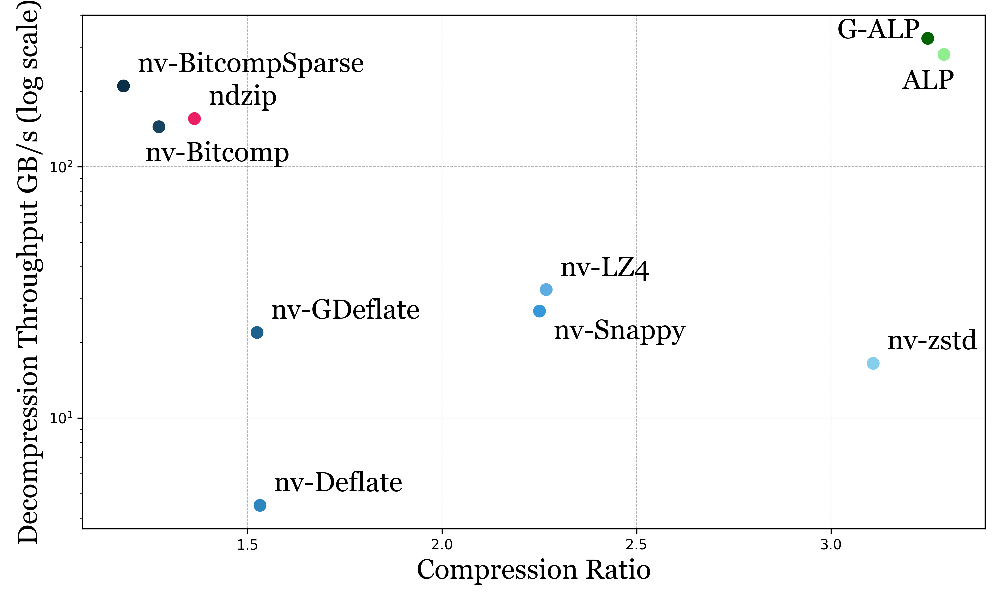
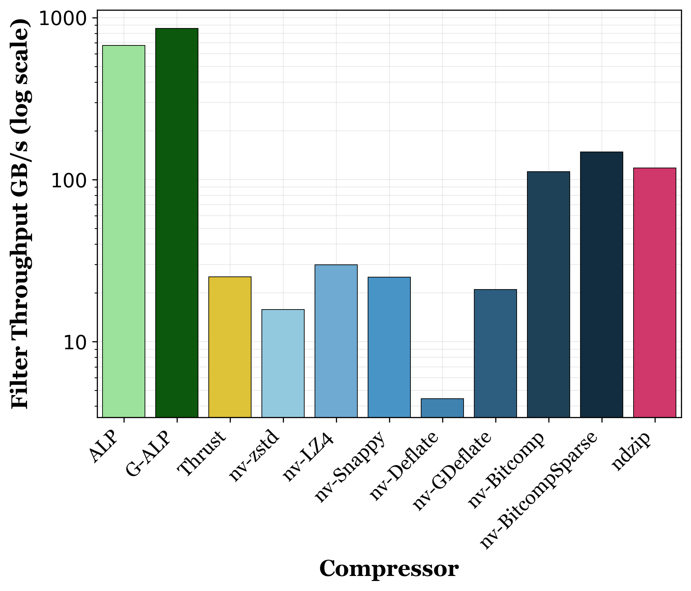

# G-ALP

[G-ALP](https://azimafroozeh.org/assets/papers/g-alp.pdf) is a compression scheme for floating-point data on GPUs. 

- G-ALP is a *light-weight* compression encoding.
- G-ALP is designed for *OLAP* workloads, prioritizing high compression and high decompression throughput.
- G-ALP has a *single value* decoding API, allowing for fine-grained access to compressed data.
- G-ALP decoding API is *kernel-agnostic*.
- G-ALP is based on [*ALP*](https://github.com/cwida/ALP), but with *data-parallel* exception patching .
- G-ALP is part of the development of the [*FastLanes project*](https://github.com/cwida/FastLanes).

G-ALP matches nv-zstd's compression ratio while outperforming all other encodings in decompression throughput in this decompression into GPU RAM benchmark.


G-ALP is almost an order of magnitude faster in a filter benchmark on compressed data by fusing the decompression and processing kernel in this filter benchmark on compressed data. 


Fusing the decompression and processing kernel is possible with the kernel-agnostic single value decoding API. The decoding API makes no assumption about the kernel that calls it, and requires no access to special memory regions (shared memory or constant memory). This allows any kernel to decompress G-ALP encoded data.

This repository contains the source code and benchmark results for the paper ["G-ALP: Rethinking Light-weight Encodings for GPUs"](https://azimafroozeh.org/assets/papers/g-alp.pdf), presented at DaMoN 2025 in Berlin. The benchmarks can be repeated on a machine with an NVIDIA GPU using the benchmarking script provided in the repo. In this repo only a GPU decompressor for G-ALP is implemented.

# Compilation

Software requirements:

- nvcc 
- nvCOMP  
- clang++-14 (to compile ALP)
- g++-12 (to compile nvCOMP)

To compile all executables, run:

```sh
make all -j 8
```

The full compilation takes a while, `-j 8` adds multiprocessing to compilation. 

To only compile the compressor benchmarks for real data benchmarking:
```sh
make compressors-benchmark
```

# Benchmarks

Requires [Nsight Compute CLI](https://docs.nvidia.com/nsight-compute/NsightComputeCli/index.html). To test on real datasets, place the binary files of single precision float arrays into the folder `binary-columns`.
NCU requires sudo to read performance counters.

Compile the code, and run all benchmarks:

```sh
make benchmark-all
```

To run only the benchmarks:

```sh
make benchmark-compressors
```
